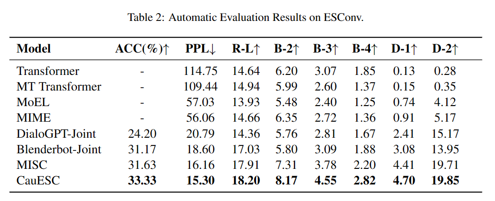

# CauESC

This is the repository of our EMNLP 2023 paper CauESC: A Causal Aware Model for Emotional Support Conversation.

The source code will be released after the relevant paper accepted. If your want to make a **human evaluation** with CauESC, the results are available in `cauesc_result`. And **automatic evaluation** can be used as follows.

